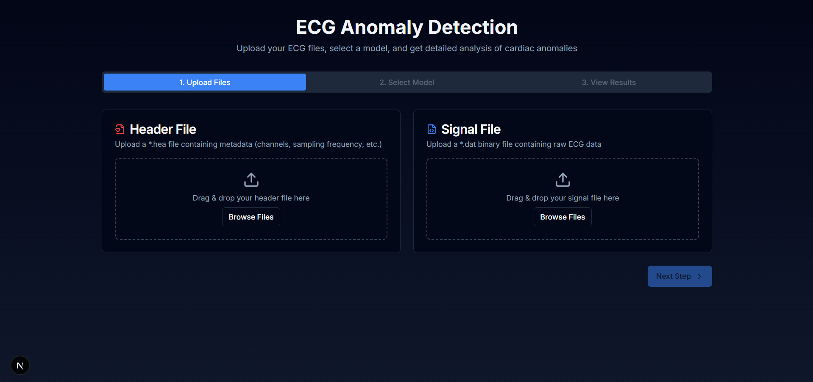
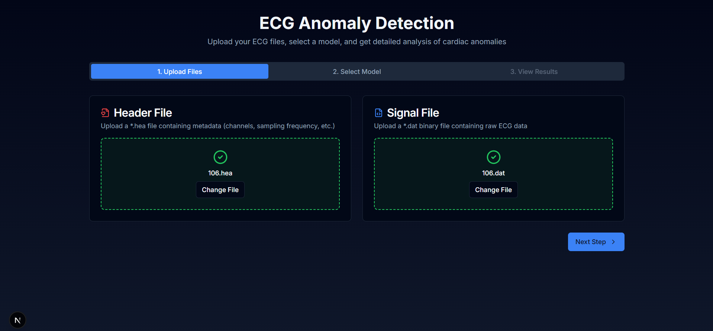
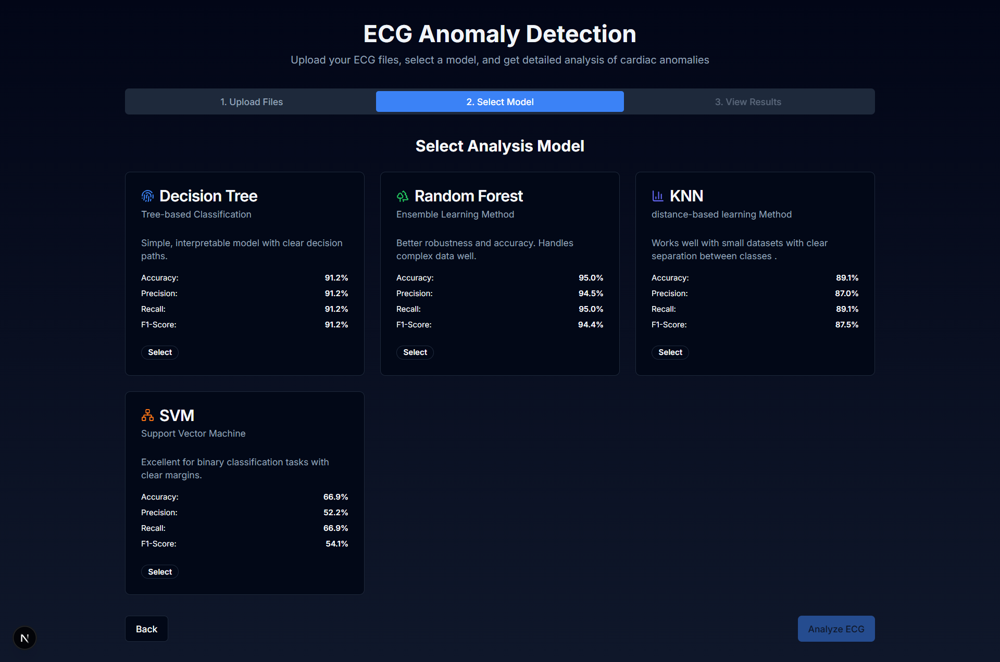
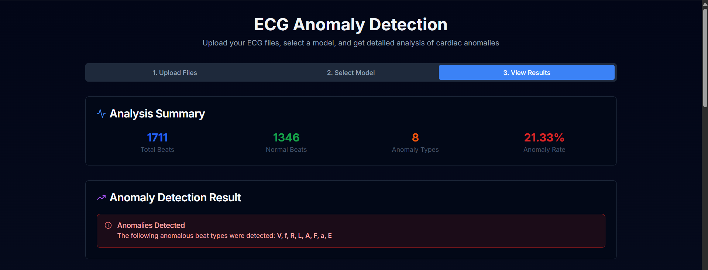
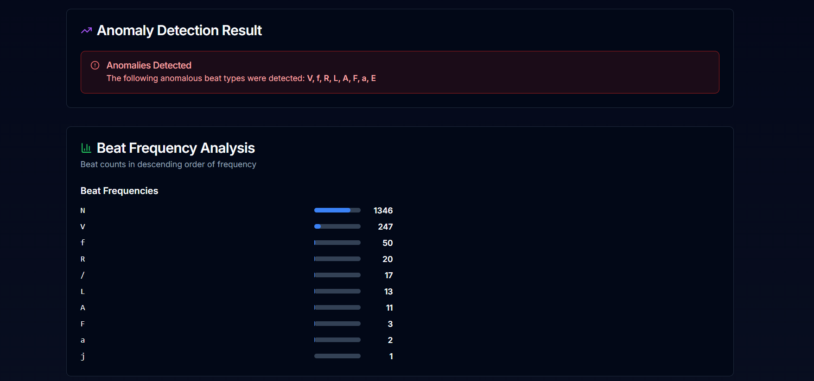
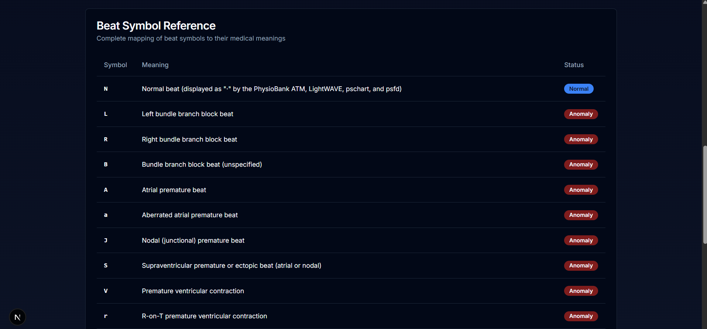
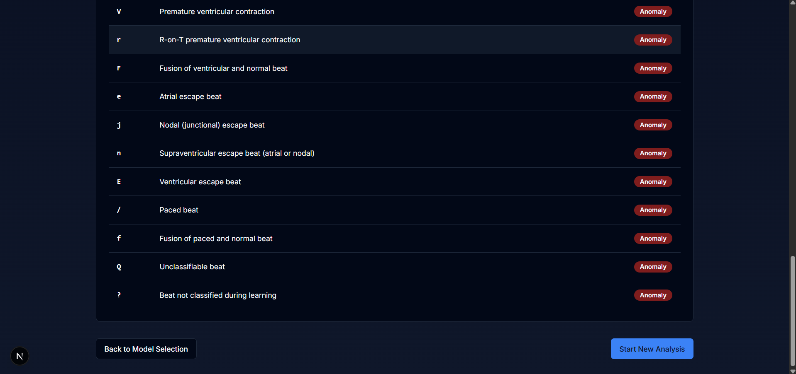

# Classification of Cardiac Anomalies from ECG Signals

This project provides a comprehensive system for classifying cardiac anomalies using Electrocardiogram (ECG) signals. It features a web-based frontend built with Next.js for user interaction and a robust backend powered by FastAPI for data processing, machine learning model training, and real-time prediction.

## Project Overview

The primary goal of this project is to accurately classify different types of heartbeats (cardiac anomalies) based on ECG signal data. The system encompasses the entire machine learning pipeline:

1.  **Data Acquisition & Preparation:** Utilizes the standard MIT-BIH Arrhythmia Database.
2.  **Signal Preprocessing:** Implements filtering techniques (Bandpass, Notch) to clean the raw ECG signals and normalization to standardize the data.
3.  **Feature Extraction:** Extracts relevant morphological and statistical features from individual heartbeats.
4.  **Model Training:** Trains multiple machine learning classifiers (Random Forest, SVM, KNN, Decision Tree) on the extracted features and annotated beat types.
5.  **Real-time Prediction:** Offers an API endpoint to classify beats from newly uploaded ECG signals using the trained models.
6.  **Web Interface:** Provides a user-friendly interface for uploading ECG data, selecting a model, and viewing classification results.

This system aims to provide a practical tool for analyzing ECG data and identifying potential cardiac irregularities.


## Model and Training Details

This section provides an in-depth look at the machine learning pipeline employed in this project, covering the dataset, preprocessing techniques, feature extraction methods, model training procedures, and the real-time prediction process.

### Dataset

The project utilizes the well-known **MIT-BIH Arrhythmia Database**. Key characteristics include:

*   **Source:** Contains 48 excerpts of ECG recordings, each lasting 30 minutes, sourced from 47 different patients.
*   **Channels:** Each recording includes two ECG leads, primarily the Modified Lead II (MLII), which is standard for rhythm analysis due to its clear P-QRS-T wave visibility, and a secondary precordial lead (V1, V2, V4, or V5).
*   **Data Format:** The database provides data in specific formats:
    *   `.hea` (Header): Contains metadata like sampling frequency (360Hz for MIT-BIH), number of samples, signal length, etc.
    *   `.dat` (Signal): Raw ECG signal data in binary format.
    *   `.atr` (Annotation): Crucial for supervised learning, this file contains timestamps for detected R-peaks and the corresponding cardiologist-annotated beat type (e.g., Normal, PVC, APC).
*   **Usage in Project:** The backend service loads data directly from a local copy of this database (expected in `fastapi/test/mit-bih-arrhythmia-database-1.0.0/`) during the initial training phase. It specifically uses the MLII lead for analysis.

### Preprocessing

Before feature extraction and model training, the raw ECG signals undergo several preprocessing steps implemented in the `preprocess_ecg` function within the backend (`fastapi/test/models.py`):

1.  **Bandpass Filtering:** A Butterworth filter (4th order) is applied to remove baseline wander and high-frequency noise outside the primary range of ECG signals. The passband is set between 0.5 Hz and 15.0 Hz.
2.  **Notch Filtering:** A notch filter is used to specifically eliminate powerline interference, typically at 50 Hz (or 60 Hz depending on the region). The implementation uses a notch at 50 Hz with a quality factor (Q) of 35.
3.  **Normalization:** The filtered signal is normalized using Z-score normalization (subtracting the mean and dividing by the standard deviation) to ensure that the signal amplitude variations do not disproportionately affect the model.

### Feature Extraction

The project employs a beat-wise classification approach. For each detected heartbeat (centered around the R-peak identified from the `.atr` files), a segment of the signal is extracted. From these segments, the `extract_features` function calculates a set of features:

*   **Basic Statistical Features:** Mean, standard deviation, minimum value, and maximum value of the signal segment.
*   **Wavelet-Based Features:**
    *   A Ricker wavelet (also known as the Mexican hat wavelet) is convolved with the beat segment.
    *   Features derived from the convolution result include: Energy (sum of squared values), Maximum absolute value, and Mean value.
*   **Duration/Morphology Features:**
    *   Peak-to-peak amplitude range within the QRS complex region (approximated).
    *   Total duration of the extracted beat segment in seconds (calculated as segment length divided by sampling frequency).

These features aim to capture the morphological characteristics of each heartbeat, which are indicative of different cardiac conditions.

### Model Training

The training process is triggered automatically when the FastAPI backend starts if pre-trained models are not found in the `cache/` directory.

1.  **Data Loading:** The backend iterates through all patient records in the MIT-BIH database directory.
2.  **Beat Extraction & Feature Calculation:** For each record, it reads the signal (`.dat`) and annotations (`.atr`), preprocesses the signal, identifies beat segments based on R-peak annotations, and extracts the features described above for every beat.
3.  **Label Encoding:** The annotated beat types (e.g., 'N', 'L', 'R', 'V', 'A') are converted into numerical labels using `sklearn.preprocessing.LabelEncoder`.
4.  **Data Splitting:** The entire dataset (features and encoded labels) is split into training and testing sets using `sklearn.model_selection.train_test_split`. The configuration uses an 80/20 split (20% for testing), shuffles the data, and uses a fixed `random_state` (42) for reproducibility.
5.  **Model Training:** Four different classification models from `scikit-learn` are trained on the training data:
    *   **Random Forest:** `RandomForestClassifier(n_estimators=100, random_state=42)`
    *   **Support Vector Machine (SVM):** `SVC(kernel='rbf', C=1.0, gamma='scale', probability=True)` (Note: `probability=True` might be needed for some applications but isn't strictly necessary for basic classification and adds computational cost; the current code doesn't specify it, but it's often useful).
    *   **K-Nearest Neighbors (KNN):** `KNeighborsClassifier(n_neighbors=5)`
    *   **Decision Tree:** `DecisionTreeClassifier(random_state=42)`
6.  **Evaluation:** After training, each model's performance is evaluated on the held-out test set. Standard metrics like Accuracy, Precision, Recall, F1-Score, and a detailed Classification Report are calculated using `sklearn.metrics`.
7.  **Caching:** The trained models (`global_models`) and the evaluation results (`global_results`) are saved to disk (`cache/models.pkl` and `cache/results.pkl` respectively) using `pickle` for persistence. This avoids retraining on subsequent server restarts.

### Prediction Pipeline

Once the models are trained and cached (or loaded from cache), the backend provides an API endpoint (`/predict/{model_name}`) for real-time predictions:

1.  **Input:** The endpoint accepts an uploaded ECG file (expected to be in `.dat` format, accompanied by a corresponding `.atr` file in the same upload or accessible location, although the current code seems to assume the `.atr` file exists alongside the uploaded `.dat` in a temporary location).
2.  **Processing:** The uploaded signal is read, preprocessed, and beats/features are extracted using the same functions (`preprocess_ecg`, `extract_beats`, `extract_features`) employed during training.
3.  **Prediction:** The features are fed into the specified trained model (e.g., 'Random Forest'), which predicts the class label for each beat.
4.  **Output:** The numerical predictions are converted back to the original beat type labels (e.g., 'N', 'V') using the saved `LabelEncoder`. The results (model name and predicted labels) are returned as a JSON response.


## Installation Guide

Follow these steps to set up and run the project locally.

### Prerequisites

*   **Node.js:** (Version 18.x or later recommended for Next.js) - Download from [nodejs.org](https://nodejs.org/)
*   **pnpm:** (Used by the frontend project based on `pnpm-lock.yaml`) - Install via `npm install -g pnpm`
*   **Python:** (Version 3.8 or later recommended) - Download from [python.org](https://python.org/)
*   **pip:** (Python package installer, usually comes with Python)
*   **Git:** (For cloning the repository)
*   **MIT-BIH Arrhythmia Database:** You need to obtain this dataset separately (e.g., from [PhysioNet](https://physionet.org/content/mitdb/1.0.0/)) and place its contents into the `fastapi/test/mit-bih-arrhythmia-database-1.0.0/` directory.

### Backend Setup (FastAPI)

1.  **Clone the repository:**
    ```bash
    git clone https://github.com/HelmiDev03/HelmiDev03-Classification-of-Cardiac-Anomalies-from-ECG-Signals.git
    cd HelmiDev03-Classification-of-Cardiac-Anomalies-from-ECG-Signals/fastapi
    ```

2.  **Create and activate a virtual environment:**
    ```bash
    # For Linux/macOS
    python3 -m venv venv
    source venv/bin/activate

    # For Windows
    python -m venv venv
    .\venv\Scripts\activate
    ```

3.  **Install dependencies:**
    ```bash
    pip install -r requirements.txt
    ```

4.  **Prepare the Dataset:**
    *   Download the MIT-BIH Arrhythmia Database.
    *   Ensure the database files (`.dat`, `.hea`, `.atr`) are located within the `fastapi/test/mit-bih-arrhythmia-database-1.0.0/` directory relative to the project root.

5.  **Run the backend server:**
    *   Navigate to the `fastapi/test` directory:
        ```bash
        cd fastapi/test
        ```
    *   Start the Uvicorn server:
        ```bash
        uvicorn models:app --reload --host 0.0.0.0 --port 8000
        ```
    *   The backend API will be accessible at `http://localhost:8000`. The first time it runs, it will train the models using the dataset, which might take some time. Subsequent runs will load cached models.

### Frontend Setup (Next.js)

1.  **Navigate to the frontend directory** (from the project root):
    ```bash
    cd ../ecg-analysis
    # Or if you are in the root: cd ecg-analysis
    ```

2.  **Install dependencies:**
    ```bash
    pnpm install
    ```

3.  **Run the frontend development server:**
    ```bash
    pnpm dev
    ```

4.  **Access the application:** Open your web browser and navigate to `http://localhost:3000` (or the port specified in the console output).

## Usage Instructions

1.  **Start Both Servers:** Ensure both the FastAPI backend (running on port 8000) and the Next.js frontend (running on port 3000) are active.
2.  **Access the Web Interface:** Open `http://localhost:3000` in your browser.
3.  **Upload ECG Data:** Use the file upload interface to select an ECG signal file (`.dat` format from the MIT-BIH dataset or similar). The application implicitly expects the corresponding annotation file (`.atr`) to be available for processing on the backend (ensure the backend has access to the necessary `.atr` file for the uploaded `.dat` file, typically by having the full dataset available).
4.  **Select Model:** Choose one of the trained models (Random Forest, SVM, KNN, Decision Tree) from the dropdown menu.
5.  **Get Predictions:** Click the prediction button. The frontend will send the uploaded data to the backend API endpoint (`http://localhost:8000/predict/{model_name}`).
6.  **View Results:** The backend processes the signal, extracts features, runs the selected model, and returns the predicted anomaly classifications for each beat. The frontend will display these results, likely showing the classified beats or a summary report.


## Screenshots

Here are some screenshots illustrating the application's user interface and functionality:

**Main Interface:**


**File Upload:**


**Model Selection:**


**Prediction Results Display:**



**Detailed Beat Classification:**




## Technologies Used

This project leverages a modern stack for web development and machine learning:

### Frontend (ecg-analysis/)

*   **Framework:** [Next.js](https://nextjs.org/) (React framework for server-side rendering and static site generation)
*   **Language:** [TypeScript](https://www.typescriptlang.org/)
*   **Styling:** [Tailwind CSS](https://tailwindcss.com/) (Utility-first CSS framework)
*   **UI Components:** Likely [Shadcn/UI](https://ui.shadcn.com/) (based on `components.json`)
*   **Package Manager:** [pnpm](https://pnpm.io/)

### Backend (fastapi/)

*   **Framework:** [FastAPI](https://fastapi.tiangolo.com/) (High-performance Python web framework)
*   **Language:** [Python](https://www.python.org/)
*   **ML/Data Science Libraries:**
    *   [Scikit-learn](https://scikit-learn.org/): For machine learning models (Random Forest, SVM, KNN, Decision Tree), preprocessing (LabelEncoder), and evaluation metrics.
    *   [Pandas](https://pandas.pydata.org/): For data manipulation and analysis (implicitly used, though not heavily visible in the provided `models.py` snippet).
    *   [NumPy](https://numpy.org/): For numerical operations and array handling.
    *   [SciPy](https://scipy.org/): For scientific and technical computing, including signal processing functions (e.g., filtering).
*   **ECG Data Handling:** [WFDB Python](https://github.com/MIT-LCP/wfdb-python) (Library for reading, writing, and processing PhysioBank signals and annotations).
*   **Web Server:** [Uvicorn](https://www.uvicorn.org/) (ASGI server for running FastAPI).
*   **Environment Management:** [venv](https://docs.python.org/3/library/venv.html) (Recommended for managing Python dependencies).

### Dataset

*   **[MIT-BIH Arrhythmia Database](https://physionet.org/content/mitdb/1.0.0/)**: Standard dataset for ECG arrhythmia analysis.

